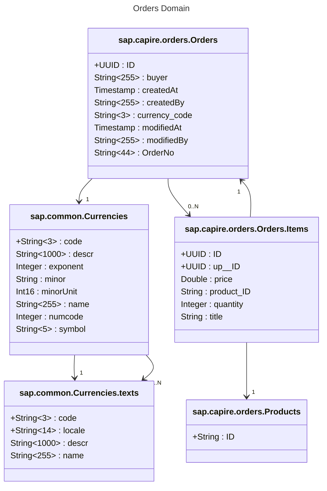

```mermaid
---
title: Orders Domain
---
classDiagram
class sap.capire.orders.Orders {
 +UUID : ID
  String~255~ : buyer
  Timestamp : createdAt
  String~255~ : createdBy
  String~3~ : currency_code
  Timestamp : modifiedAt
  String~255~ : modifiedBy
  String~44~ : OrderNo
}

sap.capire.orders.Orders --> "1" sap.common.Currencies
sap.capire.orders.Orders --> "0..N" sap.capire.orders.Orders.Items

class sap.capire.orders.Products {
 +String : ID
}


class sap.common.Currencies {
 +String~3~ : code
  String~1000~ : descr
  Integer : exponent
  String : minor
  Int16 : minorUnit
  String~255~ : name
  Integer : numcode
  String~5~ : symbol
}

sap.common.Currencies --> "1" sap.common.Currencies.texts
sap.common.Currencies --> "0..N" sap.common.Currencies.texts

class sap.capire.orders.Orders.Items {
 +UUID : ID
 +UUID : up__ID
  Double : price
  String : product_ID
  Integer : quantity
  String : title
}

sap.capire.orders.Orders.Items --> "1" sap.capire.orders.Products
sap.capire.orders.Orders.Items --> "1" sap.capire.orders.Orders

class sap.common.Currencies.texts {
 +String~3~ : code
 +String~14~ : locale
  String~1000~ : descr
  String~255~ : name
}


```
