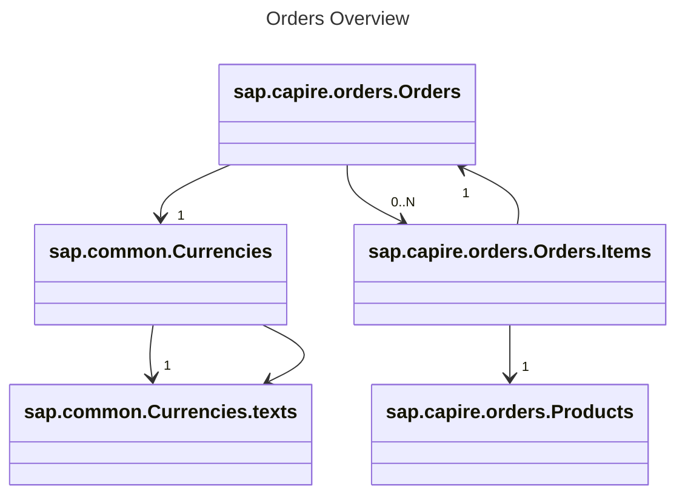

```mermaid
---
title: Orders Overview
---
classDiagram
class sap.capire.orders.Orders {
}

sap.capire.orders.Orders --> "1" sap.common.Currencies
sap.capire.orders.Orders --> "0..N" sap.capire.orders.Orders.Items

class sap.capire.orders.Products {
}


class sap.common.Currencies {
}

sap.common.Currencies --> "1" sap.common.Currencies.texts
sap.common.Currencies --> "0..N" sap.common.Currencies.texts

class sap.capire.orders.Orders.Items {
}

sap.capire.orders.Orders.Items --> "1" sap.capire.orders.Products
sap.capire.orders.Orders.Items --> "1" sap.capire.orders.Orders

class sap.common.Currencies.texts {
}


```
